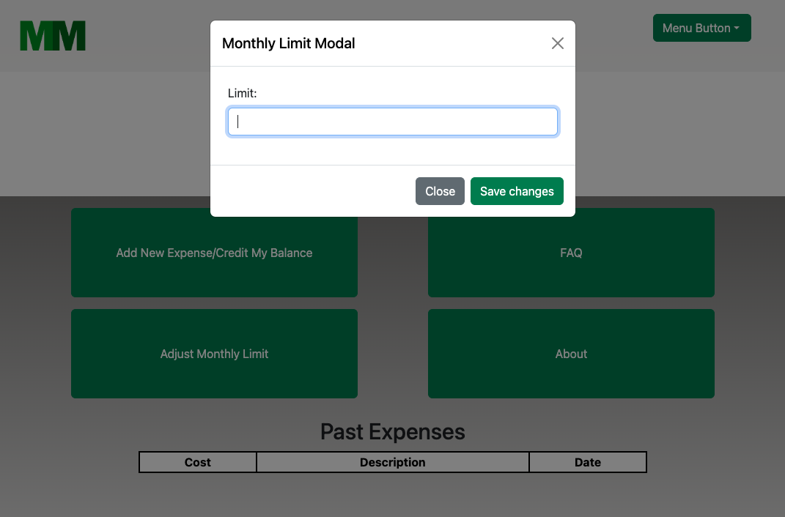

# Money Minder

## Description

 MoneyMinder is a financial application that allows users to track their personal budget. It can log expenses and store info about them - a description, the cost amount, and the date it was made on. The user can set their target goal for their budgeting period, and then compare the growing total of expenses they log against that goal over time.

Our motivation was to create an elegent digital solution for staying on top of monthly expenses. We plan to achieve this by continuously building on our knowledge of HTML, CSS and Javascript. The ultimate goal of this application is to empower users to achieve financial freedom. We learned the importance of keeping an organized repository while collaborating with a development team.

## Installation 

https://mcaiati2.github.io/money-minder/

## Usage

**Add New Expense/Credit My Balance Button:**  
This button is used to enter a positive or negative value to add or subtract from your current balance. Once you click the button, type the category, expense amount, and date of the expense. If you'd like to add a credit amount to your balance, enter the value as a negative number. To reset your total balance when the new month rolls over, enter the exact amount of your current balance as a negative value. This will set the value back to 0 for the new month.  
   
   

**Adjust Monthly Limit:**  
This button allows you to enter a dollar amount so so that you can visually see what you have set your monthly balance to be. Once the amount is logged, it will appear at the top of your home page alongside the total. You can change this to a new limit at  any time by clicking the button again and setting a new limit. 
  
  

**FAQ:**  
This button directs you to the app's FAQ page.

**About:**  
This button directs you to the app's About page.

**Expense Table:**  
This shows a list of your expenses in the order they were logged.  
  

## Credits

Mike Caiati - https://github.com/mcaiati2

Nina DeLucia - https://github.com/delucianina 

Izzy Figueroa - https://github.com/IzzyFigueroa

## License

MIT License

Copyright (c) 2024 mcaiati2

Permission is hereby granted, free of charge, to any person obtaining a copy
of this software and associated documentation files (the "Software"), to deal
in the Software without restriction, including without limitation the rights
to use, copy, modify, merge, publish, distribute, sublicense, and/or sell
copies of the Software, and to permit persons to whom the Software is
furnished to do so, subject to the following conditions:

The above copyright notice and this permission notice shall be included in all
copies or substantial portions of the Software.

THE SOFTWARE IS PROVIDED "AS IS", WITHOUT WARRANTY OF ANY KIND, EXPRESS OR
IMPLIED, INCLUDING BUT NOT LIMITED TO THE WARRANTIES OF MERCHANTABILITY,
FITNESS FOR A PARTICULAR PURPOSE AND NONINFRINGEMENT. IN NO EVENT SHALL THE
AUTHORS OR COPYRIGHT HOLDERS BE LIABLE FOR ANY CLAIM, DAMAGES OR OTHER
LIABILITY, WHETHER IN AN ACTION OF CONTRACT, TORT OR OTHERWISE, ARISING FROM,
OUT OF OR IN CONNECTION WITH THE SOFTWARE OR THE USE OR OTHER DEALINGS IN THE
SOFTWARE.

